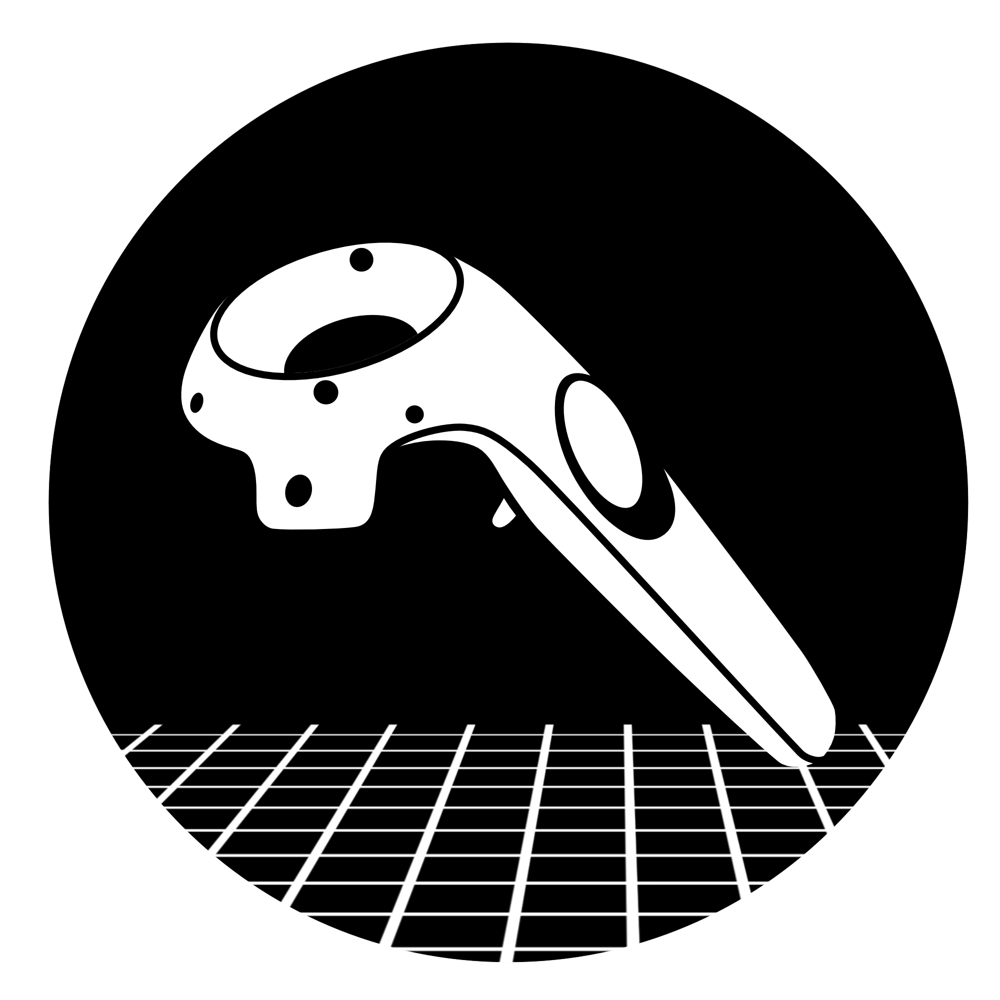
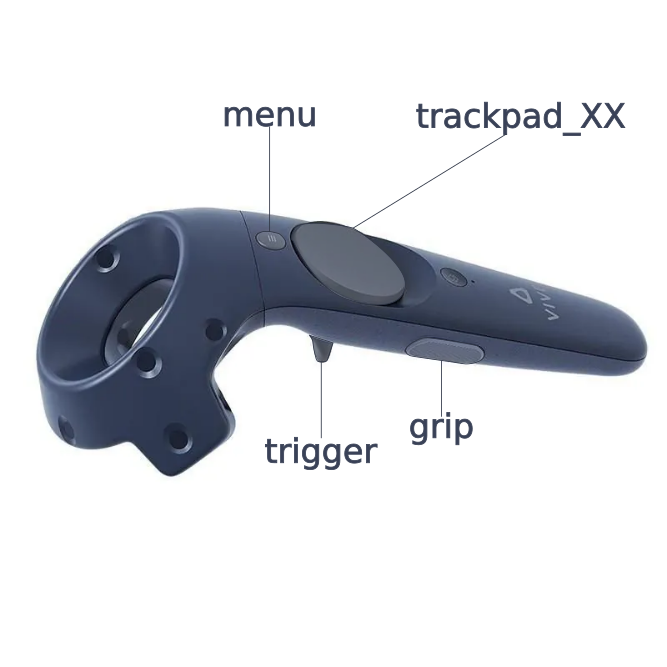
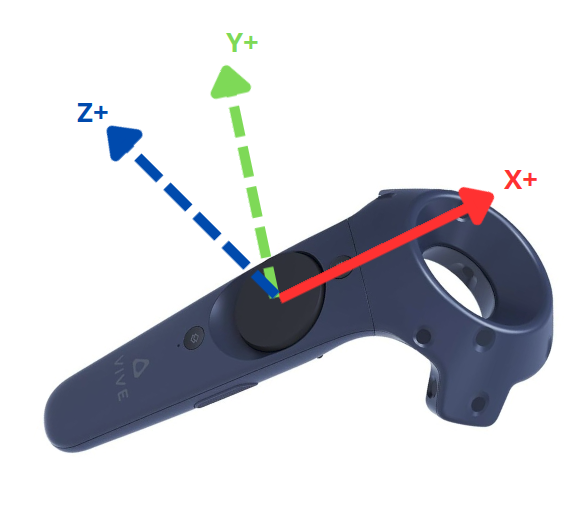

# ROS 2 Vive Controller
[](https://opensource.org/licenses/BSD-3-Clause)

A unified ROS 2 driver and teleoperation bridge for HTC Vive hardware (Controllers, Trackers 3.0, and Base Stations). This package provides a standalone, heavily optimized Dockerized workflow for workspace calibration, robot teleoperation, and reliable 6-DOF tracking.

|  | **Teleoperation in Action** |
| :---: | :---: |
|  |  |

---

## 📋 Table of Contents
- [🛠️ Prerequisites](#️-prerequisites)
- [⚙️ Configuration](#️-configuration)
- [🚀 Quick Start & Deployment](#-quick-start--deployment)
- [⚙️ The Vive Driver Node (`vive_node.py`)](#️-the-vive-driver-node-vive_nodepy)
- [🛠️ The Teleop Bridge Node (`teleop_bridge_node.py`)](#️-the-teleop-bridge-node-teleop_bridge_nodepy)
- [🤖 Adding Your Own Robot (Custom Launch Files)](#-adding-your-own-robot-custom-launch-files)

---

## 🛠️ Prerequisites

### Hardware
* **HTC Vive Base Stations** (Lighthouse): At least one is mandatory for tracking.
* **HTC Vive Controllers** or **Vive Trackers (3.0)**.
* **Micro USB to USB-A Cables**: For connecting the controllers to the host machine during setup and calibration.

### Software
* **Docker**
* **Make** (`sudo apt install make`).
* **Steam Account**: A valid username and password are required to download the headless SteamVR server during the initial Docker build.

---

## ⚙️ Configuration

This project relies on a `.env` file to map your specific hardware to the Docker containers.

1. Copy the template file:
   ```bash
   cp .env.template .env
   ```

2. Open `.env` and fill in your details:

```env
   # --- 1. Steam Credentials (For Build) ---
   STEAM_USER=your_steam_username
   STEAM_PASSWORD=your_steam_password

   # --- 2. Network & Scale ---
   ROS_DOMAIN_ID=2
   LINEAR_SCALE=1.75 # Adjust to scale operator movement to robot movement

   # --- 3. Hardware Serials ---
   SERIAL_LEFT=LHR-97752221       # Left Controller/Tracker ID
   SERIAL_RIGHT=LHR-4BB3817E      # Right Controller/Tracker ID
   REFERENCE_LIGHTHOUSE_SERIAL=LHB-2E7D2119 # The master Lighthouse used as the TF origin (0,0,0)
   ```
   > **Tip:** Don't know your serial numbers? Run `make identify` once the container is running to vibrate the controllers and verify which is which!
   > Otherwise, you can run `sudo dmesg -w | grep "LHR"` for the controllers or `sudo dmesg -w | grep "LHB"` for the base stations while plugging them in to see their serial numbers in real time.

---

## 🚀 Quick Start & Deployment

We use a `Makefile` to simplify interacting with the multi-profile `docker-compose.yml`. You never need to install ROS 2 or SteamVR on your host machine.

### 1. Build or Pull the Image (For Internal Usage)
> ⚠️ The pull step can only be used by our team members for now, for safety reasons we do not provide images publicly, since they require steam credentials to build.
```bash
# Option A (Internal): Pull the pre-built image from the registry
make pull

# Option B (Standard): Build it locally (requires STEAM_USER / STEAM_PASSWORD in .env)
make build
```

### 2. Launch a Robot Mission
The `docker-compose.yml` is divided into specific robot profiles. Simply run the make command for your target hardware. This automatically passes X11 permissions for RViz, injects your `.env` variables, and sets the CycloneDDS network interfaces.
```bash
make franka      # Start Franka (Single Right Arm)
make tiago       # Start TIAGo (Dual Arm)
make tiago_pro   # Start TIAGo Pro (Dual Arm)
make g1          # Start Unitree G1 (Dual Arm Humanoid)
```

### 3. Utilities
Manage the lifecycle and hardware with these helper commands:
```bash
make identify    # Vibrates the connected controllers to verify left/right bindings
make calibrate   # Launches the workspace calibration tool with RViz
make stop        # Safely shuts down running containers
make clean       # Removes all containers and orphans
```

---

## ⚙️ The Vive Driver Node (`vive_node.py`)

The driver is the core interface between the OpenVR runtime and ROS 2. It handles hardware tracking, filtering, safety limits, and coordinate transformations.

### 🌟 Key Features

* **Dynamic Lighthouse Origin (Stable TF Tree):** Standard SteamVR uses an invisible, arbitrary "Standing Universe" origin. This node allows you to specify a `reference_lighthouse_serial`. If found, the node automatically computes the math to make that physical Lighthouse the exact $(0,0,0)$ origin of your TF tree. It even applies an automatic 180° Z-axis flip to correct standard Lighthouse hardware alignments.
* **Hot-Plug Polling:** Uses continuous OpenVR event polling. If a tracker or lighthouse is turned on *after* the Docker container starts, the node will gracefully detect it, establish the TF tree, and begin vibrating/tracking without needing a restart.
* **Virtual Safety Fence (Haptics):** Monitors the controller's position against calibrated workspace bounds (`workspace.x_min`, etc.). If the hardware enters the padding zone, it triggers immediate 2ms haptic pulses to physically warn the operator.
* **OneEuro Filtering:** Implements a high-speed, low-latency OneEuro filter to eliminate high-frequency hand jitter before it reaches the robot arm.

### 📊 Data Outputs & TF Tree

The driver automatically broadcasts a standard `tf2` tree:
`vive_world` ➔ `lighthouse_origin` (if configured) ➔ `vive_right_link`

It also publishes the following topics in its designated namespace (e.g., `/vive/right/`):

| Topic | Type | Description |
| :--- | :--- | :--- |
| `pose` | `geometry_msgs/PoseStamped` | Filtered 6-DOF position and orientation. Frame ID matches the Lighthouse if configured. |
| `joint_states` | `sensor_msgs/JointState` | The raw monolithic array of all analog/digital button inputs. |
| `workspace_marker` | `visualization_msgs/Marker` | A semi-transparent red cube for RViz representing the safe tracking zone. |

*(Note: You can trigger a massive haptic vibration via the `/vive/right/identify` service to figure out which controller you are holding).*

### 🕹️ Button Mapping (`joint_states`)

The driver publishes button inputs directly from OpenVR as a standard `JointState` array. The `position` array contains the values for the following keys:

| Index | Name | Type | Range | Description |
| :---: | :--- | :--- | :--- | :--- |
| **0** | `trigger` | Analog | `0.0` - `1.0` | The index finger trigger. Used for the **Clutch**. |
| **1** | `trackpad_x` | Analog | `-1.0` - `1.0` | Horizontal touch position on the round pad. |
| **2** | `trackpad_y` | Analog | `-1.0` - `1.0` | Vertical touch position on the round pad. |
| **3** | `grip` | Digital | `0.0` / `1.0` | The side grip buttons (squeezing the handle). |
| **4** | `menu` | Digital | `0.0` / `1.0` | The small button above the trackpad. |
| **5** | `trackpad_touched` | Digital | `0.0` / `1.0` | True if the thumb is touching the pad. |
| **6** | `trackpad_pressed` | Digital | `0.0` / `1.0` | True if the trackpad is physically clicked down. |

<div align="center">
  
</div>

> **Note:** Digital buttons are published as floats (`0.0` for False, `1.0` for True) to maintain consistency within the `JointState` message standard.

---

## 🛠️ The Teleop Bridge Node (`teleop_bridge_node.py`)

This node sits between the raw Vive Driver and your robot's Cartesian controllers. It implements a **Clutch Mechanism** (Deadman Switch) to allow for safe, intuitive teleoperation by separating translation and rotation logic.

### 🧠 Core Logic: Hybrid Positioning

To provide the most intuitive experience, the bridge treats position and orientation differently:

1. **Relative Translation (The Mouse Metaphor):** Position is calculated as a delta from the moment the clutch (the `trigger` button) is engaged. This allows you to "ratchet" the robot's position, moving it large distances through multiple small hand strokes while staying in a comfortable physical stance.
2. **Absolute Orientation (The Mirror Metaphor):** Rotation is **not relative**. For intuitive control, the robot's end-effector orientation directly mirrors the controller's orientation.
3. **Axis Realignment (`rotation_offset`):** Because a VR controller's physical axes rarely match a robot gripper's axes, the node supports a custom `[Roll, Pitch, Yaw]` offset parameter. It applies this rotation locally using Scipy matrix math so the robot moves exactly how your brain expects it to.

### 📐 Reference Frames & Alignment
To properly map the VR controller to your robot using `rotation_offset`, you must understand the controller's default OpenVR axes:

<div align="center">
  
</div>

* **Z-axis:** Points "out" from the controller tip.
* **X-axis:** Points to the right side of the controller.
* **Y-axis:** Points "up" through the trackpad.

### 🎮 Button Demultiplexing (`PointStamped`)

Standard ROS 2 robot controllers rarely accept monolithic `JointState` arrays for simple commands like opening a gripper.

The Teleop Bridge automatically "demultiplexes" the VR buttons. You can map any Vive button to its own dedicated topic in the launch file. The bridge publishes these as `geometry_msgs/PointStamped` messages (storing the analog/digital value in the `point.x` field), which is the standard format expected by many ROS 2 action servers and bridges.

### 🛡️ Trackpad Safety

The node includes a `trackpad_pressed_required` parameter. If set to `true`, lightly brushing your thumb over the trackpad will output `0.0`. It will only output the X/Y coordinates to your robot if you physically *click down* on the trackpad. This is critical for preventing accidental movement commands on mobile bases or humanoids.

---

## 🤖 Adding Your Own Robot (Custom Launch Files)

The `ros2_vive_controller` is designed to be completely robot-agnostic. To control a new robot, you do **not** need to modify the Python source code. You only need to create a new launch file (e.g., `my_robot.launch.py`) that includes the base Vive driver and configures the `teleop_bridge_node` to match your robot's TF tree and topic names.

### The Anatomy of a Robot Launch File

A complete robot launch file consists of two main parts:

#### 1. The Hardware Driver Include
You must include `vive_teleop.launch.py`. This starts the hardware communication and RViz.
* **`only_right`**: Set to `'true'` for single-arm robots (like Franka), or `'false'` for dual-arm robots (like TIAGo/G1).
* **`linear_scale`**: A multiplier for physical movement. (e.g., A scale of `2.0` means moving the controller 10cm moves the robot 20cm).

#### 2. The Teleop Bridge Node(s)
You must instantiate one `teleop_bridge_node` per arm. This is where the magic happens. You need to configure the following critical parameters to match your robot's URDF/controllers:

* **`reference_frame`**: The root frame of the robot (e.g., `base_link`, `pelvis`). The bridge uses this to calculate relative deltas.
* **`target_frame`**: The end-effector frame of the robot (e.g., `panda_hand_tcp`, `gripper_grasping_link`).
* **`rotation_offset`**: A `[Roll, Pitch, Yaw]` array (in degrees). VR controllers rarely align perfectly with robot grippers. Use this to permanently rotate the output orientation so that pointing the controller forward actually points the robot hand forward.
* **Button Topics**: Demultiplex the monolithic VR array into specific `PointStamped` topics. For example, map `'menu_topic'` to `'/my_robot/gripper_command'` to easily hook up an action server later.

### 📝 Template: `custom_robot.launch.py`

Here is a streamlined template based on a dual-arm setup (like TIAGo Pro) that you can copy and adapt for your own robot:
```python
import os
from ament_index_python.packages import get_package_share_directory
from launch import LaunchDescription
from launch.actions import DeclareLaunchArgument, IncludeLaunchDescription
from launch.launch_description_sources import PythonLaunchDescriptionSource
from launch.substitutions import LaunchConfiguration
from launch_ros.actions import Node

def generate_launch_description():
    pkg_share = get_package_share_directory('ros2_vive_controller')
    hardware_launch_path = os.path.join(pkg_share, 'launch', 'vive_teleop.launch.py')

    # 1. Start the Base Hardware Driver (Dual Arm Mode)
    include_vive_teleop = IncludeLaunchDescription(
        PythonLaunchDescriptionSource(hardware_launch_path),
        launch_arguments={
            'rviz': 'true',
            'serial_right': LaunchConfiguration('serial_right', default='LHR-XXXXX'),
            'serial_left': LaunchConfiguration('serial_left', default='LHR-YYYYY'),
            'only_right': 'false',
            'linear_scale': '1.0'
        }.items()
    )

    # 2. Configure the Right Arm Teleop Bridge
    teleop_bridge_right = Node(
        package='ros2_vive_controller',
        executable='teleop_bridge_node',
        name='teleop_bridge_right',
        output='screen',
        parameters=[{
            # Inputs from Driver
            'pose_topic': '/vive/right/pose',
            'button_state_topic': '/vive/right/joint_states',

            # Output to your Robot's Cartesian Controller
            'output_topic': '/my_robot/right_arm/target_pose',
            'publish_frequency': 30.0,

            # TF Alignment
            'reference_frame': 'base_link',
            'target_frame': 'right_gripper_link',
            'rotation_offset': [180.0, 0.0, 0.0], # Adjust if gripper moves backwards!

            # Button Remapping (PointStamped Outputs)
            'trigger_topic': '/vive/right/clutch_trigger',
            'menu_topic': '/my_robot/right_gripper/toggle',
            # ... add other buttons as needed
        }]
    )

    # (Repeat for Left Arm if necessary...)

    return LaunchDescription([
        include_vive_teleop,
        teleop_bridge_right
    ])
```

### 🐳 Integrating with Docker and Make
Once you have written your `my_robot.launch.py` and saved it in the `/launch` folder:
1. Open `docker-compose.yml`.
2. Copy an existing robot block (like `tiago:`), rename it, and change the `command:` to run your new launch file.
3. Open `Makefile` and add a quick launch rule (e.g., `make my_robot: gui-perms \n docker compose --profile my_robot up`).

## 👥 Maintainers & Contributors

This package is actively developed by the **[HuCeBot Team](https://github.com/hucebot)** at Inria / Loria.


**Authors & Core Contributors:**
* Authors/Maintainers: **[Dionis Totsila](https://github.com/dtotsila)**, **[Jean-Baptiste Mouret](https://github.com/jbmouret)**
* Active contributors: **[Hippolyte Henry](https://github.com/hippolyte-bleu)**
* Other contributors: **[Clemente Donoso](https://github.com/cdonoso)**